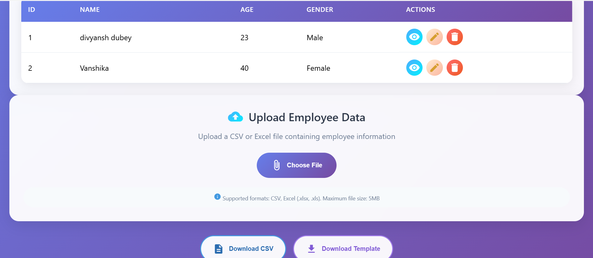
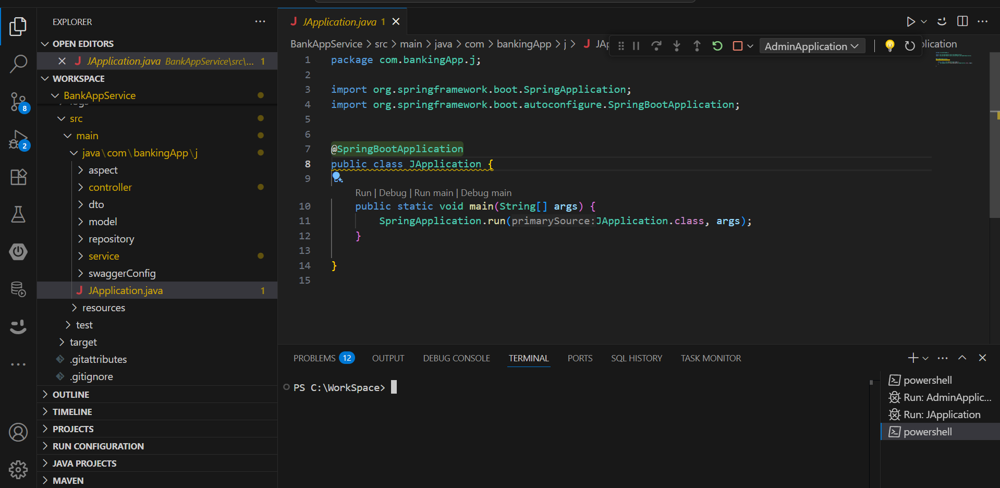
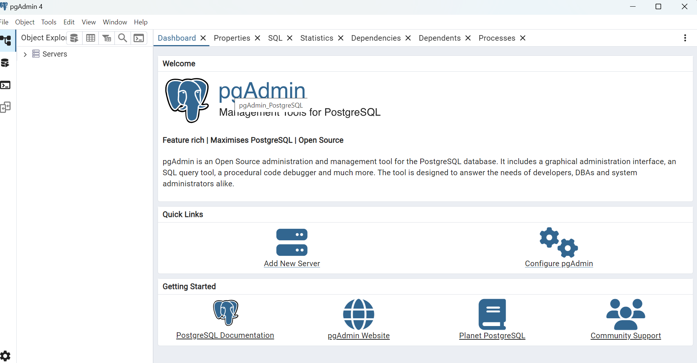
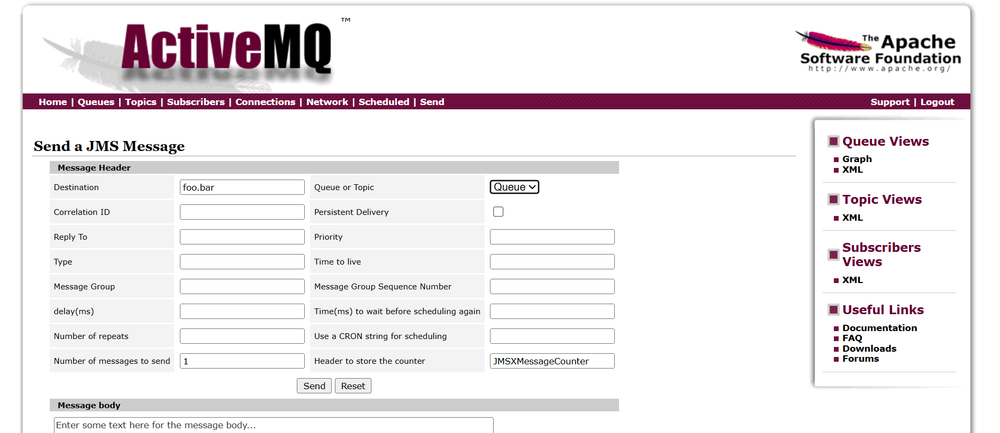
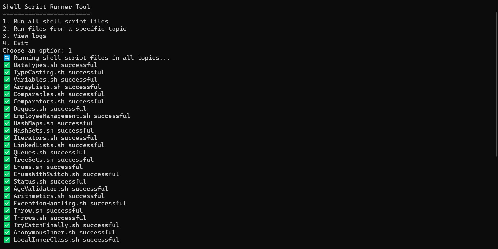

# FullStack Insight Hub

Welcome to the **FullStack Insight Hub**!  
This repository demonstrates a full-stack architecture with hands-on examples across **Python**, **Java**, a complete end-to-end application with **Angular** (frontend) and **Spring Boot** (backend) — now powered by **PostgreSQL** as the database. You'll also find a unique **ShellScript** project where Java and Python files are converted to shell scripts for enhanced learning. Advanced features include **logging**, **Spring Boot Admin**, and an **ActiveMQ listener**.

---

## 🚀 Tech Stack Overview

| Tech/Service         | Description                                             |
|----------------------|--------------------------------------------------------|
|     | `BankWebAppService` — Modern SPA frontend with Angular |
|  | `BankAppService` — Robust backend APIs with Spring Boot |
|  | Reliable open-source SQL database for backend storage |
|  | Monitoring and managing Spring Boot apps |
|  | `BankAppListenerService` — Async listener service |
|             | Java code samples and backend projects |
|     | Python code samples for data and backend logic |
|  | Shell scripts for running and learning from Java/Python |
|             | Centralized & contextual application logging |

---

## 📂 Repository Structure

```plaintext
/
│
├── BankWebAppService/        # Angular frontend project
│   └── ...                   # Components, modules, styles, etc.
│
├── BankAppService/           # Spring Boot backend API project
│   ├── src/
│   ├── logs/                 # Logging outputs/configs
│   └── ...                   # Controllers, services, configs
│
├── BankAppListenerService/   # Spring Boot ActiveMQ listener project
│   ├── src/
│   └── ...                   # Listener implementation
│
├── java-examples/            # Standalone Java code samples
│   └── ...
│
├── python-examples/          # Standalone Python code samples
│   └── ...
│
├── shellscript-examples/     # Shell scripts for Java & Python logic
│   ├── *.sh                  # Shell scripts converted from Java/Python
│   └── README.md             # Usage and conversion notes
│
└── README.md                 # You are here!
```

---

## 🖥️ Interactive Folder Highlights

- **[BankWebAppService](./BankWebAppService/)**  
  Your Angular Single Page Application (SPA) for user interface and experience.

- **[BankAppService](./BankAppService/)**  
  Main backend APIs, business logic, and database connectivity via Spring Boot. Features integrated logging, uses PostgreSQL as the primary database, and is monitored using Spring Boot Admin.

- **[BankAppListenerService](./BankAppListenerService/)**  
  Dedicated service for asynchronous processing using ActiveMQ listeners, implemented in Spring Boot.

- **[java-examples](./java-examples/)**  
  Collection of Java scripts and mini-projects for algorithm, data structure, or backend logic demos.

- **[python-examples](./python-examples/)**  
  Collection of Python scripts for data processing, analysis, or backend tasks.

- **[shellscript-examples](./shellscript-examples/)**  
  Shell scripts that demonstrate key logic originally written in Java and Python, now translated for enhanced cross-language understanding.  
  > _Check this folder for scripts and notes on how the logic maps from Java/Python to shell scripting!_

---

## 📡 Key Features

- **Full-Stack Example:** Seamless integration between Angular frontend and Spring Boot backend.
- **PostgreSQL Database:** Reliable and scalable SQL backend for data storage and management.
- **Spring Boot Admin:** Visual monitoring and management of backend applications.
- **ActiveMQ Listener:** Real-time asynchronous task handling and event-driven architecture.
- **Centralized Logging:** Track, search, and debug application events efficiently.
- **ShellScript Learning:** Java and Python logic reimagined in shell scripting for comparison and learning.
- **Python & Java Examples:** Expand your understanding with standalone code samples.

---

## 🏁 Getting Started

1. **Clone the repository**
   ```sh
   git clone https://github.com/idivyanshdubey/FullStack-Insight-Hub.git
   cd FullStack-Insight-Hub
   ```

2. **Setup and run each project individually:**  
   - Frontend: See [BankWebAppService/README.md](./BankWebAppService/README.md)
   - Backend: See [BankAppService/README.md](./BankAppService/README.md)
   - Listener: See [BankAppListenerService/README.md](./BankAppListenerService/README.md)
   - Shell Scripts: See [shellscript-examples/README.md](./shellscript-examples/README.md)

---

## 📸 Screenshots

> _Add your screenshots below! For best results, place your images in a `/screenshots` directory and reference them here._

| App Section               | Screenshot                                                   |
|---------------------------|-------------------------------------------------------------|
| **Angular Frontend**      |    |
| **Spring Boot Backend**   |  |
| **PostgreSQL Admin**      |  |
| **Spring Boot Admin**     |      |
| **ActiveMQ Listener**     |  |
| **ShellScript Demos**     |  |

---

## 📑 Contributing

Contributions are welcome! Please fork the repo, make changes, and open a pull request.

---

## 📬 Contact

Created and maintained by [@idivyanshdubey](https://github.com/idivyanshdubey)

---

_✨ Happy Coding! ✨_
